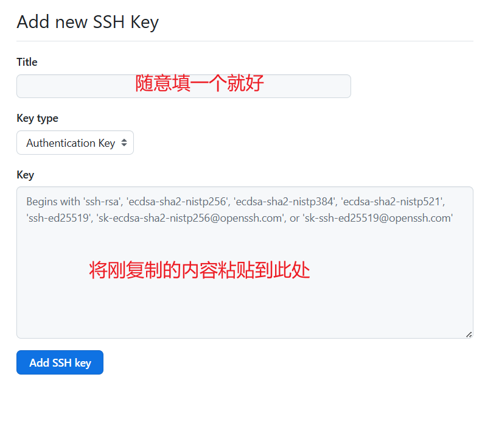

# Git 入门笔记

## 工作原理

**仓库的概念**

其可分为**本地仓库**和**远程仓库**

远程仓库：托管在网络端的仓库

本地仓库：可分为工作区、版本区，其中版本区又包含了暂存区和仓库区

从本地仓库将文件git推送到远程仓库的流程为：工作区—暂存区—仓库区—远程仓库


## 入门操作流程

创建项目SSH Key，打开Git Bash

配置用户名：

```c
git config -global user.name "github用户名"
```

配置用户邮箱：

```c
git config -global user.email "github注册邮箱"
```

创建Key：

```c
ssh-keygen -t rsa -C "github注册邮箱"
```

完成后可检查配置是否成功


在用户目录中找到**.ssh**文件夹，找到创建密钥时保存的**.pub**文件用记事本打开并复制其中内容


>   id_rsa是私钥
>
>   id_rsa.pub是公钥

打开GitHub按照图示进行操作

>   打开设置


>   点击SSH和GPG密钥


>   新的ssh密钥


>   输入密钥



>   完成后点击 **Add SSH key** 添加密钥


将Github仓库复制到本地

在本地新建一个文件夹，在文件夹内打开Git Bash

使用  **git clone "仓库HTTPS链接"** 命令将仓库复制到本地

在本地仓库内更改或添加文件后推送至远程仓库

```c
git init //初始化仓库
git remite add origin "仓库链接"  //添加远程仓库
git pull --rebase origin //获取远程仓库和本地同步

git add "修改或新增文件"  //将工作区文件添加至暂存区
git commit -m "备注信息"  //将暂存区的内容提交到仓库区
git push origin '分支'  //将仓库区内容推送到远程仓库
```

在第一次提交时会显示验证，正常登录github账号即可