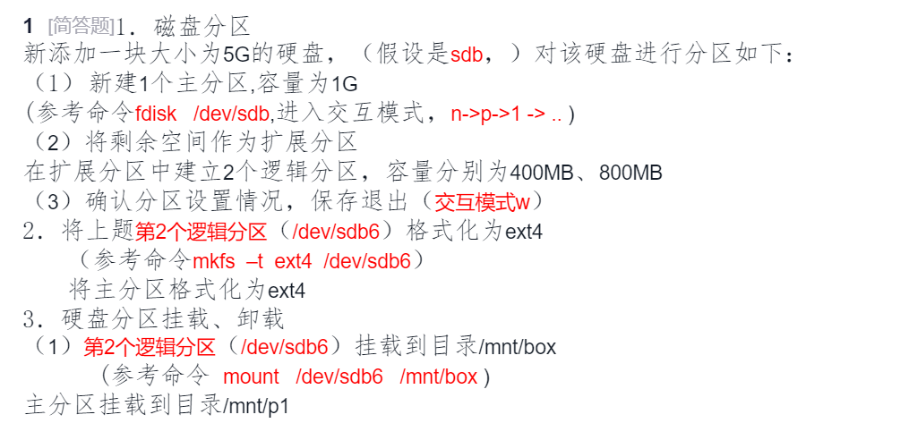
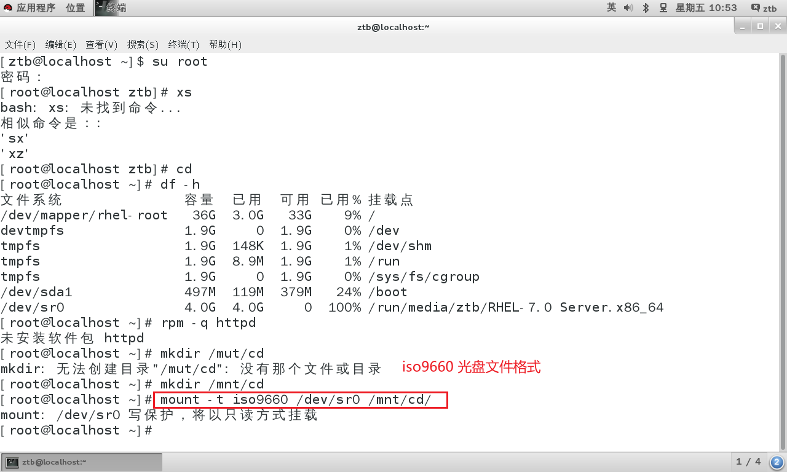

# Linux

## 磁盘分区

```
lsblk
```

显示 Linux 系统中所有已挂载卷的信息。该工具通过读取 udev 数据库和 sysfs 文件系统来获取硬盘信息。

### 测试题

#### 1. 磁盘分区

```
# 进入fdisk交互模式
sudo fdisk /dev/sdb

# 交互模式操作步骤：
n       # 新建分区
p       # 主分区
1       # 分区号1
回车     # 起始扇区默认
+1G     # 大小1G

n       # 新建扩展分区
e       # 扩展分区
2       # 分区号2
回车     # 起始扇区默认（接主分区后）
回车     # 结束扇区默认（使用剩余空间）

n       # 新建第一个逻辑分区
回车     # 起始扇区默认
+400M   # 大小400MB

n       # 新建第二个逻辑分区
回车     # 起始扇区默认
+800M   # 大小800MB

p       # 查看分区表确认设置
w       # 保存并退出
```

#### 2. 格式化分区

```
# 格式化逻辑分区sdb6为ext4
sudo mkfs -t ext4 /dev/sdb6

# 格式化主分区sdb1为ext4
sudo mkfs -t ext4 /dev/sdb1
```

#### 3. 挂载分区

```
# 创建挂载目录
sudo mkdir -p /mnt/box
sudo mkdir -p /mntp1

# 挂载逻辑分区sdb6到/mnt/box
sudo mount /dev/sdb6 /mnt/box

# 挂载主分区sdb1到/mntp1
sudo mount /dev/sdb1 /mntp1
```

#### 验证挂载

```
# 查看挂载情况
df -hT | grep sdb
```

#### 卸载分区（可选）

```
# 卸载分区
sudo umount /mnt/box
sudo umount /mntp1
```

#### 注意事项：

- **逻辑分区编号**：主分区为`sdb1`，扩展分区为`sdb2`，逻辑分区从`5`开始，因此第二个逻辑分区为`sdb6`。
- **目录创建**：若挂载目录不存在需先创建（`mkdir -p`确保父目录存在）。
- **持久挂载**：若需开机自动挂载，需将配置写入`/etc/fstab`。


LVM逻辑卷管理

> 注意：boot分区用于存放引导文件，不能应用LVM机制

基本概念

PV:物理卷

整个硬盘或使用fdisk等磁盘工具建立的普通分区

使用多个默认大小4MB大小的单元及PE（基本单元）

VG：卷组

一个或多个物理卷组合而成的整体

VL：逻辑卷

从卷中分割出的一块空间，用于建立文件系统

## 挂载与卸载

在 Linux 系统中，`mount` 和 `umount`（或 `unmount`）是用于挂载和卸载文件系统（如光盘、ISO 镜像、USB 设备、网络存储等）的命令。  

---

### **一. `mount` 命令（挂载文件系统）**
#### **基本语法**
```bash
mount [选项] <设备或源> <挂载点>
```
#### **常见用法**
##### **(1) 挂载光盘或 ISO 镜像**
```bash
# 挂载光盘（设备通常为 /dev/cdrom 或 /dev/sr0）
mount /dev/cdrom /mnt/cdrom

# 挂载 ISO 文件
mount -o loop CentOS-7-x86_64.iso /mnt/iso
```
##### **(2) 挂载 USB 设备**
```bash
# 查看 USB 设备名称（如 /dev/sdb1）
lsblk

# 挂载 USB
mount /dev/sdb1 /mnt/usb
```
##### **(3) 挂载 NFS 网络共享**
```bash
mount -t nfs 192.168.1.100:/shared /mnt/nfs
```
##### **(4) 查看已挂载的文件系统**
```bash
mount       # 列出所有挂载点
mount | grep /mnt  # 筛选特定挂载点
```
##### **(5) 重新挂载（如改为可读写）**
```bash
mount -o remount,rw /mnt/cdrom
```

---

### **`mount -t` 基本语法**

在 Linux 中，`mount -t` 用于指定要挂载的文件系统类型（filesystem type）。如果不指定 `-t`，`mount` 通常会尝试自动检测文件系统类型，但有时需要手动指定以确保正确挂载。

```bash
mount -t <文件系统类型> <设备或源> <挂载点>
```

---

#### **常见的文件系统类型（`-t` 参数选项）**

| 文件系统类型 | 说明                               | 示例                                                         |
| ------------ | ---------------------------------- | ------------------------------------------------------------ |
| `ext4`       | Linux 标准文件系统（硬盘分区）     | `mount -t ext4 /dev/sda1 /mnt/data`                          |
| `xfs`        | 高性能文件系统（常用于企业级存储） | `mount -t xfs /dev/sdb2 /mnt/disk`                           |
| `iso9660`    | CD/DVD/ISO 镜像文件系统            | `mount -t iso9660 /dev/cdrom /mnt/cdrom`                     |
| `vfat`       | FAT32/exFAT（U盘、SD卡）           | `mount -t vfat /dev/sdc1 /mnt/usb`                           |
| `ntfs`       | Windows NTFS 文件系统              | `mount -t ntfs /dev/sdd1 /mnt/win`                           |
| `nfs`        | 网络文件系统（NFS共享）            | `mount -t nfs 192.168.1.100:/share /mnt/nfs`                 |
| `cifs`       | SMB/CIFS（Windows共享）            | `mount -t cifs //192.168.1.100/share /mnt/smb -o username=user` |
| `tmpfs`      | 内存临时文件系统                   | `mount -t tmpfs tmpfs /mnt/tmp`                              |
| `btrfs`      | Btrfs 高级文件系统                 | `mount -t btrfs /dev/sde1 /mnt/btrfs`                        |

---

#### **常见用法示例**

#### **1. 挂载 NTFS 格式的硬盘（需 `ntfs-3g` 支持）**

```bash
mount -t ntfs /dev/sdb1 /mnt/windows
```

如果报错，可能需要安装 `ntfs-3g`：

```bash
yum install ntfs-3g  # RHEL/CentOS
apt install ntfs-3g  # Debian/Ubuntu
```

#### **2. 挂载 NFS 网络共享**

```bash
mount -t nfs 192.168.1.100:/data /mnt/nfs
```

#### **3. 挂载 CIFS/SMB 共享（Windows 共享）**

```bash
mount -t cifs //192.168.1.100/share /mnt/smb -o username=user,password=123
```

如果要避免密码明文存储，可以使用凭证文件：

```bash
echo "username=user" > ~/.smbcred
echo "password=123" >> ~/.smbcred
chmod 600 ~/.smbcred
mount -t cifs //192.168.1.100/share /mnt/smb -o credentials=~/.smbcred
```

#### **4. 挂载 ISO 镜像**

```bash
mount -t iso9660 -o loop CentOS-7-x86_64.iso /mnt/iso
```

#### **5. 挂载临时内存文件系统（tmpfs）**

```bash
mount -t tmpfs tmpfs /mnt/ramdisk -o size=1G
```

这样 `/mnt/ramdisk` 会使用内存存储，重启后数据消失。

---

#### **注意事项**

1. **`-t` 可以省略**（`mount` 会自动检测文件系统类型）：

   ```bash
   mount /dev/sdb1 /mnt/data  # 自动检测 ext4/xfs/ntfs
   ```

2. **如果挂载失败**：

   - 检查设备是否存在：`lsblk`
   - 检查文件系统类型是否正确：`blkid /dev/sdb1`
   - 检查是否安装相关工具（如 `ntfs-3g`、`nfs-utils`、`cifs-utils`）

3. **卸载使用 `umount`**：

   ```bash
   umount /mnt/data
   ```

---

#### **总结**

| 命令                                           | 用途                           |
| ---------------------------------------------- | ------------------------------ |
| `mount -t ext4 /dev/sda1 /mnt/data`            | 挂载 ext4 分区                 |
| `mount -t ntfs /dev/sdb1 /mnt/win`             | 挂载 NTFS 分区（需 `ntfs-3g`） |
| `mount -t nfs 192.168.1.100:/data /mnt/nfs`    | 挂载 NFS 共享                  |
| `mount -t cifs //192.168.1.100/share /mnt/smb` | 挂载 SMB/CIFS 共享             |
| `mount -t iso9660 -o loop file.iso /mnt/iso`   | 挂载 ISO 镜像                  |


### **二. `umount` 命令（卸载文件系统）**

#### **基本语法**
```bash
umount <挂载点或设备>
```
#### **常见用法**
##### **(1) 通过挂载点卸载**
```bash
umount /mnt/cdrom
```
##### **(2) 通过设备名卸载**
```bash
umount /dev/sdb1
```
##### **(3) 强制卸载（如果设备忙）**
```bash
umount -l /mnt/usb  # 延迟卸载（lazy unmount）
umount -f /mnt/nfs  # 强制卸载（可能损坏数据，慎用）
```
##### **(4) 卸载所有挂载点（危险！谨慎使用）**
```bash
umount -a  # 卸载所有可卸载的文件系统
```

---

#### **常见问题 & 解决办法**
##### **Q1: 报错 `umount: target is busy`**
**原因**：有进程正在使用挂载点（如 shell 当前目录在 `/mnt/cdrom`）。  
**解决方法**：
```bash
# 查找占用进程
lsof | grep /mnt/cdrom

# 杀死相关进程（或退出占用目录）
kill <PID>
```
或者使用延迟卸载：
```bash
umount -l /mnt/cdrom
```

##### **Q2: 如何开机自动挂载？**
编辑 `/etc/fstab` 文件：
```bash
/dev/cdrom  /mnt/cdrom  iso9660  ro,user,auto  0  0
```
然后测试：
```bash
mount -a  # 挂载所有 fstab 中的设备
```

---

#### **总结**
| 命令            | 用途                  | 示例                              |
| --------------- | --------------------- | --------------------------------- |
| `mount`         | 挂载设备              | `mount /dev/sdb1 /mnt/usb`        |
| `umount`        | 卸载设备              | `umount /mnt/usb`                 |
| `mount -o loop` | 挂载 ISO              | `mount -o loop file.iso /mnt/iso` |
| `umount -l`     | 延迟卸载              | `umount -l /mnt/cdrom`            |
| `mount -a`      | 挂载所有 `fstab` 设备 | `mount -a`                        |


## 更改yum源

```c
配置文件位置
/etc/yum.repos,d/
配置文件：***.repo
文件内容:
[资源库标记]
name=资源库名
baseurl=以http/ftp/file等开头的url地址  #如file:///mnt/cdrom
enabled=1  #含义：是否启用该仓库：1（或 yes、true）：启用；0（或 no、false）：禁用
gpgcheck=0 or 1  #含义：是否检查 RPM 包的 GPG 签名：1：启用检查（需配置 gpgkey=）；0：禁用检查
```




## shell编程常用命令

```python
pwd
history #列出使用过的命令
echo  #输出
echo $?  #输出上一条命令的运行状态码 0为正确执行
```

可以使用 **;   &&  ||**连接多条命令

&&  第一条正确执行再执行第二条否则取消

||  第一条正确执行再执行第二条否则取消