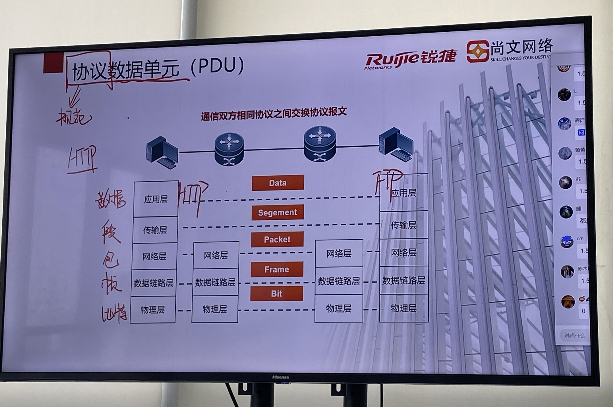

# 锐捷网络

## 基础理论

### OSI参考模型

什么是网络？

其本质就是实现资源共享，将各个系统联系到一起


OSI产生的意义：给网络一个模板，能实现不同共公司产品的互通

为什么OSI模型要分层：降低网络复杂性

分层就类似于分部门，各部门各司其职相互配合组成现在的网络，模块化后可以促进网络的更新迭代


报文的封装与解封装

发送方进行封装  接收方进行解封装


协议数据单元 PDU



传输层封装需要加端口号 -->确定应用

网络层 IP -->确定主机   IP是逻辑地址是可变的

数据链路层 MAC -->确定主机  MAC是物理地址是唯一不可变的

协议就是一种规范

数据单元相当于一个最小的模块

> **应用层 ** **提供应用程序间通信**网络应用 为用户之间通信提供专业程序 协议最多且最杂HTTP

> **表示层** **数据表示 加密 解密** 数据表示 向上对应用层提供服务，向下接收会话层服务 确保应用接收到的数据可读 规范数据格式与结构 数据压缩和解压、加密和解密

> **会话层** **会话建立维护管理** 会话建立维护管理 处理主机之间传输问题 确保数据传输的可靠性 建立、维护和终止虚电路 容错机制和流量控制

> **传输层** **建立主机端到端连接**  处理主机之间传输问题 确保数据传输的可靠性 建立、维护和终止虚电路

> **网络层** **寻址和路由** 路由数据包，提供逻辑寻址 基于网络层地址进行不同网络系统间的最优路径选择 网络层为建立连接和为上层提供服务     IP协议，IP地址约等于在网络中的门牌号（可变的）

> **数据链路层** 介质访问、链路管理 负责将上层数据封装成固态格式的帧 为了防止数据传输过程中产生误码，在帧尾部加上校验信息 还有流控机制 会试探接收方缓存调整速率大小  CSMA/CD协议

> **物理层** 

数据在不同网络设备之间转发


沿途所以设备都会进行封装和解封装，但每一个只需要解封到自己需要的层就可以了，只有发送方和接收方是完全的


### ICP/IP协议栈


#### 应用层


SNMP协议：简单网络管理协议，常用于监控网络设备，会在网络中搭建一个服务器，它会连接多个网络设备，通过snmp协议连接

1、查询响应 服务器主动发出查询信息，查询设备状态，设备收到查询要进行响应

2、告警信息 设备出现异常，不需要等待服务器查询，设备直接通过告警通知服务器

3、设置信息 服务器可以通过SNMP协议主动设定一些设备的参数，可以进行简单的设备同意管理

该协议是运维过程中非常重要的一个协议


Telnet、ssh 远程登陆协议：ssh为加密协议，Telnet为明文协议

DNS服务器无法解析可能会造成打不开网页但能正常上网


#### 传输层


TCP：面向连接的可靠传输

UDP：无连接的 尽力而为的传输   但传输快

传输层的区别

**TCP/UDP端口号范围为0~65536**，其中**0~1023是熟知端口号**，已固定分配给常用应用程序

用于在主机系统中区分不同的应用程序，数据传输最终是程序之间的互相访问

> 例1:主机A远程登录主机B，随机端口1028作为源端口，主机B的23端口作为目的端口
>
> 例2:主机A通过浏览器发起HTTP访问，随机端口作为源端口，主机C的80端口作为目的端口


注册端口号

3389 RDP   3306 mysql

动态端口号：临时使用，用完即还

源端口号：随机

目的端口号：80


链接的过程  三次握手 四次挥手

syn 询问    ack 回复  Fin 已接收

前--建立连接（三次握手） syn-->syn+ack-->syn

中--数据发送 分段   大数据单元拆分成小数据单元

​								重组-->排序-->序列号

​								重传-->确认号

​								窗口大小-->用于流控

后--释放连接（四次挥手）Fin-->Ack-->Fin-->Ack


#### 网络层

IPV4报文结构

用于标记


IPV4 2的32次方 42.9亿

IPV4 2的128次方


Type of service 服务类型 确定优先类型及流量重要程度

Qos 服务质量 数值越大越重要


网段=子网=广播域


ipv4的分类


特殊地址

本地环回地址 127.0.0.1（本地测试）

网络号：主机位全为0

​	192.168.1.0/24

子网广播地址：主机位全是1

​	192.168.1.255/24

本地广播地址

​	255.255.255.255

未知地址：网络位和主机位全为0

​	0.0.0.0.


子网划分

子网掩码必须是连续的


#### 数据链路层

ARP协议：地址解析协议

ARP信息无法跨过广播域，此时需经过网关进行逐跳转发

在数据包发送过程中，源目的IP是可以正常封装的，源MAC地址正常封装，但是目的MAC属于对方的物理地址，这个是不知道的，但目的MAC属于对方物理地址，这个是不知道的需要一个协议能根据目的地址IP找MAC地址

源主机发送ARP广播查询，目的主机收到之后单播回应ARP应答

ARP过程

PC1 192.168.1.10 发送PC3 192.168.1.30

PC1根据子网划分确认目标是否在同一个广播域，如果在则直接找到对方MAC，如果不在则直接找网关的MAC                                                                                                                                                                                                                                                                                                                                                                                                                                         

PC1检查ARP缓存表中是否存在192.168.1.30的MAC地址（发现没有对应表项）

PC1发送ARP广播查询信息查询192.168.1.30对应MAC地址

PC3收到ARP查询，PC3会记录PC1的192.168.1.10对应MAC1的关系到ARP缓存表中

PC3发送单播ARP应答信息

PC1收到应答缓存192.168.1.30 对应MAC3 进入缓存表并封包发送数据


IP用于广播域间转发，转发过程不发生变化

MAC用于广播域内转发（交换机）转发过程中经过交换机不会发生发生变化，经过路由器则为实现逐跳转载会发生变化


免费ARP

代理ARP


应用层（表述聚体数据）：HTTPS协议传输你要查询到信息

传输层 （可靠传输）TCP协议 对于数据进行分段后进行数据传输，封装源端口号随机 目的端口号443

网路层（广播域间的选路） IP协议 对于数据加入源IP和目的IP，并可以根据IP进行选路，根据最优路径发送（广播域间转发）

数据链路层 （广播域内的转发）：以太网（ARP协议） 对于数据封装源MAC和目的MAC，进行广播域内的转发（广播域间转发MAC地址，会不断变动实现逐跳转发）

物理层（网线） 物理层并没有封装新的内容，只是将数据转变为二进制电信号或者光信号进行发送 


OSI七层模型下层为上一层提供服务

应用层要发送信息，传输层得先为其建立连接

传输层建立连接的SYN


## 设备

交换机

提供大量的接口供终端用户使用，可以划分冲突域，可以实现广播域内转发


路由器

接口数量通常较少，但可以实现选路的功能，可以划分冲突域和广播域，可以实现广播域间转发，可以跨广播域转发


冲突域


广播域

数据通信： 单播 （一对一）

​					组播（一对一组）

​					广播（一对所有）

广播域过大容易广播风暴


## RGOS 锐捷通用操作系统

### 基础命令

```
enable 从用户进特模式
configure 全局配置模式
hostname 修改设备名称
show running-config  //查看当前配置
confing
no //删除命令
end //结束操作
write //保存
show users   //查看当前设备登录的用户
clear line  [用户编号]  //移除某个用户
show ip route //查看路由表 
traceroute //跟踪包信息


dot1Q
switchport mode dot1q-tunnel
```

### 远程登陆

```C
远程登录的前提是相互之间可以通信：因为还没有学习其他的通信技术，因此这个实验客户端和设备之间属于同一广播域

常规telnet配置
line vty 0 4  //vty表示虚拟控制台，0 4表示开放了五个虚拟控制台，可以同时满足五个人同时登录
password xxxxx  //配置密码
login //应用密码
//此时client进行登录测试  telnet 192.168.1.1 ，发现能登录设备，但是不能进入特权。原因是你权限低了。
用户远程权限分为0-15，数值越大权限越高。
解决方案1：
调整用户权限 
R1(config)#line vty  0 4
R1(config-line)#privilege level 15  //调整用户权限级别（注意模式）

解决方案2：
设置一个特权模式的密码。也就是用户初始权限还是很低，但是由于知道了另外一个权限高的密码特权密码，从而获得了高的权限。
因为不管是console还是远程管理都需要用到特权密码，因此在全局配置模式下进行配置
R1-test(config)#enable  password  upwen@123   //设置明文的enable密码
R1-test(config)#enable secret shangwen             //设置密码的enable密码
enable当存在密文密码的时候明文密码不生效

//分用户分权限远程登录到设备上
R2(config)#username shangwen privilege 15 password  shangwen   //创建用户shangwen密码为shangwen权限为15
R2(config)#username [name] privilege [0-15] password [xxxx]  
R2(config)#line  vty  0 4
R2(config-line)#login  local   //应用本地的账号和密码

可以SSH远程登录到设备，同时不允许telnet
enable service ssh-server //开启ssh服务
crypto key generate rsa //因为SSH是加密通信，所以选择RSA加密算法。并创建相关密钥
R3(config)#username shangwen privilege 15 password  shangwen   //创建用户shangwen密码为shangwen权限为15
R3(config)#username [name] privilege [0-15] password [xxxx]   
R3(config)#line  vty  0 4
R3(config-line)#login  local   //应用本地的账号和密码
此时telnet仍可以登陆

拒绝telnet方式一：
R3(config)#no enable service  telnet-server   //针对于整个设备关闭telnet服务
拒绝telnet方式二：
R3(config)#line  vty  0 4 
R3(config-line)#transport input  ssh   //在虚拟控制台下设置只允许SSH进行登录
```

## 路由技术

路由器内的一张表，记录了到达每个网络的最优路径

下一跳地址

出接口


### 路由表的构成与维护

#### 直连路由	C

​	通过给活动接口配置IP形成

​	直连路由直连路由表示路由器所直接连接的网络

#### 静态路由	O

​	管理员手工配置的路由信息

​	无法感知网络拓扑变化，需人为调整

​	适用于小型简单网络

#### 动态路由	S

​	路由器之间使用某种动态路由协议，根据互相传递信息生成路由信息

​	优点:在网络拓扑变化时，能够自动调整路由信息
​	缺点:会在链路中产生额外流量，给路由设备带来额外的CPU和内存开销


### 怎么看路由表？


### 管理距离

管理距离(Administrative Distance)，也叫优先级，用来衡量路由源的可信度管理距离值越低，可信度越高。

只有可信度最高的路由会被添加进路由表管理距离默认值由厂商自定义

注：不同厂商对管理距离定义会有区别（此处为思科、锐捷体系）

直连路由 0

静态路由 1

动态OSPF 110

动态RIP 120

不可达路由 255


### 路由表的度量值

度量值(Metric):路由协议用来衡量路径优劣的参数。

表示到达目的地的代价总和影响度量值的因素:线路带宽、跳数、线路延迟、线路使用率、线路可信度等

注：只有同协议直接才能相互比较

RIP计算单位为跳数

OSPF计算单位为带宽


### 路由加表原则

只有最佳路径才会被添加进路由表，形成路由条目

**比较目标网络**-->不同目标网络则放进路由表

​		如果相等-->**比较管理距离**-->管理距离最低的路径放进路由表（比协议）

​			如果相等-->**比较度量值**-->度量值最低的路径放进路由表（比开销）

​				如果相等-->**（等价）负载均衡**-->都放进路由表中，路径之间等价分担流量

EIGRP协议（思科私有协议）  可以支持不等价负载均衡

### 路由表选路原则（用表原则）----最长子网掩码匹配原则

路由设备基于数据包的目的IP地址，按照最长子网掩码匹配原则查找路由表

根据查询结果转发，查询无果则丢弃数据包


选路时会优先选择子网掩码更长的路径，因为子网掩码越长代表范围更小路径越精细


### 静态路由

> 由网络管理员手工配置的路由信息，当网络拓扑发生变化时，管理员需要手工修改静态路由信息
>
> 静态路由信息是本地有效的，不会传递给其他的路由器
>
> 静态路由一般适用于比较简单的网络环境，大型和复杂的网络环境通常不宜采用静态路由
>
> 使用静态路由好处是网络安全保密性高
>
> 使用全局配置命令ip route，配置静态路由
>
> ​		下一跳地址必须是直连网络上可达的地址
>
> ​		点对点连接时，下一跳地址可用出接口代替

```
ip route network net-mask {ip-address/interface} [distance]
ip route <目的网段> <子网掩码> <下一跳/出接口> [管理距离]
```


```
PC1：
ip 192.168.1.10 255.255.255.0 192.168.1.1


R1:
int g0/0  (注意接PC1接口)
 ip address 192.168.1.1 24
int g0/1 (接R2接口)
 ip address 192.168.2.1 24
ip route 192.168.4.0 255.255.255.0 192.168.2.2


R2:
int g0/0 (接R1接口)
 ip address 192.168.2.2 24
int g0/0 (接R3接口)
 ip address 192.168.3.2 24
ip route 192.168.1.0 255.255.255.0 192.168.2.1
ip route 192.168.4.0 255.255.255.0 192.168.3.3

R3：
int g0/0 (接R2接口)
 ip address 192.168.3.3 24
int g0/1 (接PC2接口)
 ip address 192.168.4.3 24
ip route 192.168.1.0 255.255.255.0 192.168.3.2


PC4:
ip 192.168.4.10 255.255.255.0 192.168.4.3
```

静态路由度量值恒为0

### 默认路由

```
0.0.0.0 0.0.0.0 {目标地址}
```

匹配所有目标

最后才会被使用

默认路由子网掩码是  0.0.0.0**/0**

静态、动态都会产生默认路由

明细路由访问内网默认路由访问外网

内网所有设备只要访问互联网都有默认地址

#### 常见使用场景

访问外网及互联网

只有一个出口的末端网络

PC的网关本质也是一条默认路由


注：默认路由不能互指，会出现环路


#### 浮动静态路由

在静态路由基础上加上**管理距离**，距离越小，可信的越高

```
ip route <目的网段> <子网掩码> <下一跳/出接口> [管理距离]
```

配置前提

目标网段保证一致

调整管理距离


### OSPF协议

#### 基本概念

开放式最短路径优先协议，基于链路状态（带宽）的内部网关路由协议（IGP）


专门为TCP/IP网络设计，支持VLSM（可变长子网掩码）、路由汇总、等级负载均衡、区域划分、认证（保证安全性）

在RGOS平台管理距离（AD）为**110**

OSPF报文封装在IP报文中，IP协议号为**89**

具有无环路（最短路径树）、收敛快（触发更新）、扩展性好、可适应大规模网络

版本

​	V2--IPv4

​	V3--IPv6

#### Cost值(开销值)==metri度量值

##### 接口开销计算


Router-ID  在AS系统中唯一标识一台运行OSPF的路由器编号

Router-ID 不能重复

邻居关系：双方在交换信息

邻接关系：双方已经交换完了

OSPF的三张表

邻居表 

​	能通

​	参数匹配

​		router ID

​		认证

​		区域IP

​		Hello报文

LSA  每个路由器产生，用于描述自身信息

LSAB 全网的LSA名单


DR/BDR选举

优先级0~255   默认是1  越大越好

如果选不出来选 Router-ID 越大越好

非抢占原则


区域ID

为什么划分划分区域？

为了适应大型网络，减少设备压力

```
router ospf [进程号]
router ospf 1   //进程号用于区分一个路由器上不同的OSPF进程
network xxxxx  //宣告网段
network 192.168.1.0 0.0.0.255 area0  //如果配置了192.168.1.X的地址就开启ospf
network 0.0.0.0 255.255.255.255 area0 //开启所以接口ospf ！！！不安全 慎用
宣告设备上已配置的网络，其实就是告诉别人你在这里，找这个网络来这里找
```

## 交换机

数据发送机制

CSMA/CD 带有冲突检测的载波侦听多路访问

先听后发，边听边发，冲突退回

MAC编址


光纤

单模 不可见光，传输距离远

多模 可见光，传输距离较近


802.11


无线加密机制WPA2


### MAC地址表

学习-- 源MAC+收接口

泛洪-- MAC表无 广播

转发-- MAC表有  单播

更新-- 老化时间 300s

​		-- 后到优先


### Vlan

```
vlan [ID]
name [name] //vlan命名
shwo vlan //查看Vlan

switchport mode [模式]
switchport [模式] [Vlan ID]
//锐捷的trunk默认允许所有Vlna通过,也可以手动调整允许的Vlan
switchport trunk allowed vlan only [VID]
```

虚拟局域网技术

为了在交换机上划分广播域

**优点**：减小广播域，减小广播流量，提高带宽利用率

​			不同部门的主机通过Vlan划分到不同广播域，不能直接通信，提高了一定安全性

实现原理

当数据进入交换机，为了能够区分是那个Vlan，会进行一次新的封装，在二层封装中再次插入一个802.1Q的封装，里边包含了VLAN ID

注：因为WLAN是交换机的技术,PC并不知道，因此PC无法对802.1Q进行解封装

**Vlan接口**

*Access*

​		一般用于连接终端，只允许一个Vlan通过

​		发出的数据不带802.1Q的标记

*Trunk*


​		一般用于连接设备，可以允许多个Vlan通过

​		发出的数据带有802.1Q的标记，因为要传输多个Vlan,因此带有标记用于区分多个vlan的信息 

Native Vlan 可以不带802.1Q标记

特点 有且只有一个，双方一致


**路由器**

接口种类丰富，比如存在Serial接口专门用于广域网，功能更丰富

**三层交换机**

既能完成交换机的操作又能完成路由器的操作，转发性能比较高


一般情况下网关使用三成交换机


### VLAN间通信----单臂路由

虚拟子接口


## 无线

Wireless Local Area Network 及无线局域网 WALN

是计算机网络技术与无线通信技术结合的产物

是指使用无线通信技术，将网络互连起来，构成可以相互通信和实施的


### 工作组件

**station(工作站): STA==PC**

​		支持802.11的终端设备，比如安装无线网卡的PC，支持WLAN的手机，支持WLAN的PDA等，都属于station范畴，简称STA

**Access Point(AP，接入点):**

​		为STA提供基于802.11的无线接入服务，同时将无线的802.11 mac帧格式转换为 *有线网络*（802.3）的帧，当于有线网络的无线延伸。

**Wireless Medium(无线媒介):**

​		802.11标准定义了2类物理层: 射频物理层**(2.4GHz和5GHz)**和红外物理层。目前广泛应用的是射频方式

**Distribution System(DS，分布式系统)**

​	即将各个接入点连接起来的骨干网络，通常是以太网

​	

### 服务集


BSS 基本服务集

是802.11网络提供服务的基本单元

AP1、STA1和STA2就是一个BSS

ESS

多个BSS

SSID

​	BSSID

​	ESSID


无线漫游

用户在网络范围移动中网络切换时网络不中断


### 波的概念

射频，射频信号RF

电磁波的波长与频率是有关的

光速=波长*频率

波长越长频率约小，反之亦然

频率高，波长越小，通过不同物理介质衰减越快

5G比2.4G覆盖范围更小


#### 传播行为损耗

吸收

反射：当电磁波碰到一个光滑物体就会造成反射

散射

折射

同介质下厚度越厚衰减越多

无线电磁波在传播过程中，能量不断减小，信号不断衰减

就像声音一样，离说话的人越近，听得越清楚，离说话的人越远，听得越模糊


无线信号=设备无线发射功率+天线增益-传输距离衰减-障碍物衰减


地广人稀  无线发射功率调大

高密度网络  此时影响AP接入的是用户数，因此发射功率不需要太大，覆盖自己那个小范围就行，太大反而会影响其它无线网络信号


影响AP参数

​	范围

​	人数

​	流量

​	障碍物


无线组网注意事项

​	尽量减少障碍物，在穿越障碍物时，尽量选择对应的木质门此类密度低的障碍物，尽量垂直穿越障碍物

​	多个AP部署时注意信道干扰，相邻AP之间尽量不要使用相同信道（应保证用户优先接入5G）

​	能加速无线网络：合理运用反射，MU-MIMO（多进多出技术），合理的信道捆绑，选择调制技术好的如4096QAM

#### 接收灵敏度

无线传输的接收灵敏度类似于人们沟通交谈时的听力， 即STA或AP解调出信号所要求的最低号强度

一般来说AP的接收灵敏度为-85dBm，甚至达到-105dBm，而STA的接收灵敏度一般在-75dBm

WLAN的底噪(环境噪声)为-95dBm，因此信号强度如果低于-95dBm的话，这样的信号就等同于噪声

**RSSl**(Received Signal Strength Indicator) 用来衡量接受灵敏度的指标

RSSI=X+(-95dBm)

​		例：RSSI=30，意味着接受灵敏度为为-65dBm


### 天线

天线辐射电磁波是**有方向性的**

​		 在天线的发送端，方向性指天线向一定方向辐射电磁波的能力

​		 对于接收端而言，则表示天线对来自不同方向的电磁波的接收能力,

振波粒子

天线具有信号增益

全向天线，定向天线，

吸顶天线  一般增益为2dBi


802.11协议


2.4G信道

工作频率范围2.4GHZ~2.4835GHZ

同频干扰


无线信道

默认以20MHZ为一个信道

可以使用信道捆绑技术，将两个20MHZ的信道捆绑成一个40MHZ的信道，实现带宽翻倍

信道捆绑技术优点：加速转发，可以接入更多用户

信道捆绑技术缺点：冲突增多，而且只能捆绑相邻的信道


2.4G信道太少不推荐信道捆绑

5G 共13个信道，推荐捆绑40GHZ，如果捆绑成80MHZ，只剩下三个不重叠信道，很难进行合适的信道规划


MLO 多链路传输技术和MU-MIMO

相同点

​	MLO技术和MU-MIMO空间流技术，都可以在一个AP和STA之间建立多条链路通信，同时收发信息

不同点

​	MU-MIMO空间流技术是限于AP中同一个射频芯片的，比如说16条流，指的是一个AP中一个射频芯片，可以后时对外建立16条通信链路，当然这16条通信链路可以和一个STA建立，也可以跟多个STA建立。

​	MLO技术是指一个AP中多个射频芯片同时跟同一个STA建立通信链路。

可以形象地理解为:在一个AP和一个STA之间，有三种交通媒介，铁路，公路，航空。通过三种交通媒介同时通信用到的是MLO技术。单就其中一个媒介而言，比如公路同时有16层公路可以通信，那就是MU-MIMO空间流技术


Wi-Fi7概述


### WIFI组网

无线部署设备：
AC：无线管理控制器管理AP的设备，在瘦AP架构的WLAN网络中扮演管理AP角色。
AP：无线访问接入点，提供网络服务
POE交换机：对AP进行供电，以及数据传输
STA：无线访问站点，带有无线网卡的终端

无线星空计划：
光电混合揽（线会很细，好看，不容易看出来）

FAT AP 俗称“胖AP”    可以独立控制

FIT AP 俗称“瘦AP”      通常采用集中控制，配置统一发

由**Access Controlleer（AC）** 无线控制器，对AP进行统一管理

射频统一优化管理，安全认证策略全面， L2、L3漫游，适合大规模网络


瘦AP架构工作原理----集中式转发

有线网络搭建（VLAN、DHCP、路由等）

AP零配置启动前提

​		AP与AC通信

​				--AP有地址（DHCP）

​				--做好通信操作（路由）DHCP Option138获取AC IP地址

​		AP知道AC位置

AP主动建立到达AC的CAPWAP隧道


直接转发：数据经过AC

本地转发：数据经过AC

CAPWAP隧道

控制隧道：用于控制AP

数据隧道：用于用户数据发送


集中转发：

​		用户数据发送给AP

​		AP接收到用户信息后将用户信息封装到CAPWAP的数据隧道中，转发给AC

​		AC解封装，得到用户数据，并将其转发到外网

本地转发：

​		用户数据发送给AP

​		AP接收

trunk AR VLANniq


VPN的核心技术就是隧道而隧道的核心技术就是封装


#### DHCP

```
R1(config)#senice dhcp //开DHCP服务
R1(config)#ip dhcp pool pc //建立DHCP地址池，名字为PC
R1(dhcp-config)#network 192.168.1.0255.255.255.0 //分配地址
R1(dhcp-config)#default-router 192.168.1.1 //分配网关地址
R1(dhcp-config)#dns-server 8.8.8.8 114.114.114.114R1(dhcp-config)#lease01230 //DHCP租期为0天12小时30分钟
R1(config)#ip dhcp excluded-address 192.168.1.1 192.168.1.10//排除地址
```

客户端																						服务器

​							广播发送一个Discover包-->				--发现DHCP位置	

​							<--odder 单播										--提供ip mesk 网关

​								request 广播-->									--请求配置确认

​								<-- ACK 单播									--确认

续租 request

​		第一次 租期到达50%时 单播续租  如果未成功

​		第二次 87.5%时 广播续租


DHCP中继 C/S不在同一广播域    广播转单播
